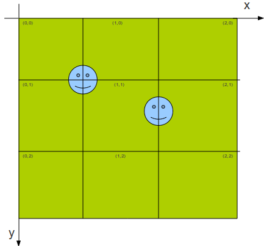

.. django-hotspots documentation master file, created by
   sphinx-quickstart on Fri Jul 15 15:30:16 2011.
   You can adapt this file completely to your liking, but it should at least
   contain the root `toctree` directive.

django-hotspots Создание слоев активных областей для Яндекс.Карт
================================================================

Современные браузеры не справляются с отрисовкой на карте многочисленного количества объектов.
Для решения этой проблемы компанией Яндекс в 2010 году была создана технология активных областей.
С помощью этой технологии на карте можно отображать десятки тысяч объектов без потери производительности, качества и удобства использования.

Вместо отрисовки многочисленного количества объектов на карте при ее загрузки, объекты отрисовываются заранее на картинках с прозрачностью, размером 256 на 256 пикселов.
При использовании карты эти изображения подгружаются и накладываются на карту. Помимо картинок подгружаются файлы JavaScript с заголовками и описанием меток.
При наведении на метку отображается ее название, при клике - появлется балун с описанием метки.

http://api.yandex.ru/maps/features/hotspots/

Ограничения
===========

Приложение предназначено для отрисовки меток.

Зависимости
===========

* python >= 2.5 (http://www.python.org)
* django >= 1.3 (http://www.djangoproject.com)
* PIL >= 1.7 (http://www.pythonware.com/products/pil/)

Термины
=======

**Географическая точка** (GeoPoint) - содержит значение долготы и широты, реализует методы преобразования географических координат в пиксельные.

**Метка** (Placemark) - создается на основе GeoPoint и содержит координаты 2-х точек для определения положения на плоскости.
Объект GeoPoint может породить до 4-х объектов Placemark. Такое дробление метки на части вызвано ее попаданием на границы соседних тайлов.

**Тайл** (Tile) - содержит в себе объекты Placemark. Реализует методы генерации файлов изображения с отрисованными метками и JavaScript с данными о метках.

   
**Менеджер активных областей** (HotspotsManager) - управляет процессом генерации тайлов, имеет гибкую настройку.

Установка
=========

.. code-block:: python

    # settings.py

    TEMPLATE_CONTEXT_PROCESSORS = (
        # ...
        'hotspots.context_processors.map_key',
    )
    
    INSTALLED_APPS = (
        # ...
        'hotspots',
    )

    HOTSPOTS_MAP_KEY = 'key yandex maps'

Настроечный класс HotspotsManager
=================================

В каталоге своего приложения создаем модуль **hotspots_manager.py**

.. code-block:: python

    # myapp/hotspots_manager.py
    from PIL import Image
    from hotspots import HotspotsManager

    class SupermarketHotspotsManager(HotspotsManager):

        img_small = Image.open('icon/small.png')
        img_big = Image.open('icon/big.png')

        def get_img(self, obj, scale):
            return self.img_big if scale > 12 else self.img_small

        def get_lng(self, obj):
            return obj.lng

        def get_lat(self, obj):
            return obj.lat

        def get_name(self, obj):
            return obj.title

        def get_descr(self, obj):
            return obj.description

Команда генерации тайлов
========================

Создаем команду для генерации тайлов **generate_tiles.py**

.. code-block:: python

    # myapp/management/commands/generate_tiles.py
    from hotspots.management import HotspotsBaseCommand
    from myapp.hotspots_manager import SupermarketHotspotsManager
    from myapp.models import Supermarket

    class Command(HotspotsBaseCommand):
        scale = (10, 14)
        hotspots_class = SupermarketHotspotsManager

        def get_iterable(self):
            return Supermarket.objects.filter(discount__gte=10)[:100]

Генерация тайлов из командной строки

.. code-block:: html

    # создать тайлы
    python manage.py generate_tiles

    # не удалять старые тайлы перед созданием новых
    python manage.py generate_tiles --no_remove

    # отображать процесс создания тайлов
    python manage.py generate_tiles --verbosity=2

Быстрый запуск
==============

Приложение умеет генерировать пример отрисовки карты с вашими метками на основе настроечного класса HotspotsManager.

.. code-block:: python

    # myproject/urls.py
    from django.conf.urls.defaults import *
    from hotspots.views import HotspotsView
    from myapp.hotspots_manager import SupermarketHotspotsManager

    urlpatterns = patterns('',
        # Посмотреть пример открыв в броузере http://localhost:8000/hotspots_test/
        url(r'^hotspots_test/$', HotspotsView.as_view(hotspots_manager_class=SupermarketHotspotsManager)),
    )

Контекст для своих представлений.

.. code-block:: python

    # myapp/views.py
    from django.views.generic import TemplateView
    from myapp.hotspots_manager import SupermarketHotspotsManager

    class HotspotsView(TemplateView):
        template_name = 'myapp/map.html'

        def get_context_data(self, **kwargs):
            context = SupermarketHotspotsManager().get_view_context()
            return context

Метод **get_view_context** передает в шаблон следующий контекст:

 * {{ MAP_KEY }} - ключ для использования карт из настроек settings.py
 * {{ source_url }} - шаблон вида `tiles/%e/%z/tile-%x-%y.%e`
 * {{ source_name }} - шаблон вида `myLayer-%x-%y-%z`